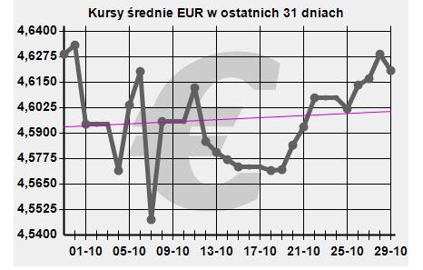

```{r setup, include=FALSE}
knitr::opts_chunk$set(echo = TRUE)
```

## Źródło oraz wizualizacja:

W pracy domowej rozpatruję wykres przedstawiający średni kurs Euro w ostatnim miesiącu. 
Wykres pochodzi ze strony <https://www.bstuchola.pl/wykresy-notowan-walut/>, (dane zostały odczytanie w przybliżeniu, ponieważ z wykresu nie dało się odczytać dokładnych wartości).

```{r}

```

## Kod oraz utworzona wizualizacja:

```{r}
library(ggplot2)

date <- c("01.10", "02.10", "03.10", "04.10", "05.10", "06.10", "07.10", "08.10", 
          "09.10", "10.10", "11.10", "12.10", "13.10", "14.10", "15.10", "16.10", 
          "17.10", "18.10", "19.10", "20.10", "21.10", "22.10", "23.10", "24.10", 
          "25.10", "26.10", "27.10", "28.10", "29.10")

euro_exchange_rate_new <- c(4.5940, 4.5945, 4.5950, 4.5712, 4.6035, 4.6212, 4.5475,
                            4.5975, 4.5977, 4.5979, 4.6145, 4.5855, 4.5800, 4.5772, 
                            4.5730, 4.5730, 4.5730, 4.5716, 4.5718, 4.5840, 4.5930, 
                            4.6080, 4.6078, 4.6076, 4.6021, 4.6148, 4.6156, 4.6278, 
                            4.6210)

df <- data.frame(date, euro_exchange_rate_new)

p <- ggplot(df) + 
  geom_line(aes(x=date, y=euro_exchange_rate_new, group=1), 
            color = 'grey70', 
            size = 0.72) +
  geom_point(aes(x=date, y=euro_exchange_rate_new), 
             size = 0.8) +
  labs(title = "Kurs euro", 
       subtitle = "01.10.2021-29.10.2021",
       x = "", 
       y = "") + 
  theme(panel.background = element_rect(fill="white"), 
        panel.grid.major = element_line(colour = "grey", linetype = "dotted"), 
        axis.text.x = element_text(angle = 60)) + 
  scale_y_continuous(breaks = seq(4.55, 4.65, 0.005), 
                     labels = c('4.5500','','4.5600','','4.5700','',
                                '4.5800','','4.5900','','4.6000','',
                                '4.6100','','4.6200','','4.6300','',
                                '4.6400','','4.6500'))
p

```

## Uzasadnienie:

Na wykresie przedstawionym w znalezionym źródle nie dało się odczytać dokładnej wartości, a odczytanie daty było utrudnione. Osie OY i OX były ponumerowane w sposób nieintuicyjny. Wykres był narysowany zbyt grubą linią, przez co nawet większe punkty nie poprawiły jego czytelności. Na poprawionym wykresie linia jest na tyle cienka, że jednocześnie pozostaje widoczna i nie utrudnia odczytywanie danych. Dodatkowe ciemniejsze punkty pomagają w lepszym odczytywaniu wartości z wykresu. Ponadto skala na osi OY jest teraz co 0.005 zł, a cały wykres jest umieszczony na delikatnej siatce poprawiającej jego czytejność. Wszystkie zabiegi znacznie poprawiły czytelność wykresu. 


