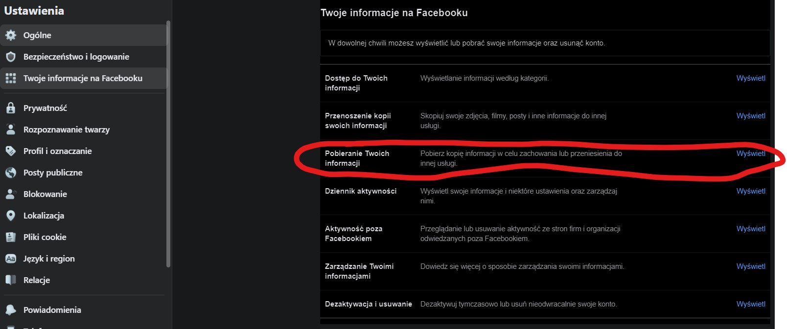
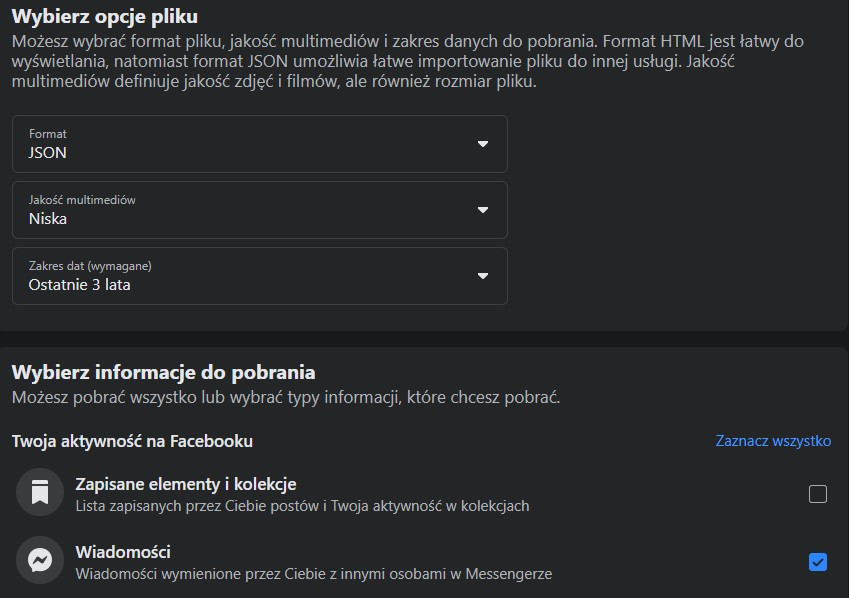

# Analiza danych z Messengera

[Link do nagrania](https://www.youtube.com/watch?v=dItPH6t5Xtc)
[Link do aplikacji](https://messenger-analysis.herokuapp.com/)

Autorzy:

- [Mikołaj Gałkowski](https://github.com/galkowskim)
- [Laura Hoang](https://github.com/hoanganhlinh)
- [Wiktor Jakubowski](https://github.com/WJakubowsk)

## Przygotowanie danych

### Wchodzimy w Ustawienia na Facebook'u i pobieramy dane zgodnie ze zdjęciami poniżej. Zalecamy pobranie danych z maksymalnie 4 lat.

Następnie wrzucamy wyciągamy folder messages z zipa i usuwamy z niego wszystko oprócz folderu inbox. W przypadku gdy mamy dwa pliki 
zip powtarzamy operację i foldery messages nazywamy tak, aby ich nazwa się różniła. Następnie w folderze **przygotowanieDanych** tworzymy 
folder **wiadomosci** i wrzucamy tam folder messages / foldery messages (różne nazwy). Wywołujemy funkcję ze skryptu **skryptDoDanych.py**
podając w argumentach swoje imię i nazwisko w stringu (np. "Mikołaj Gałkowski"). W ten sposób otrzymujemy gotową csv'ke, którą możemy użyć
na stronie 
